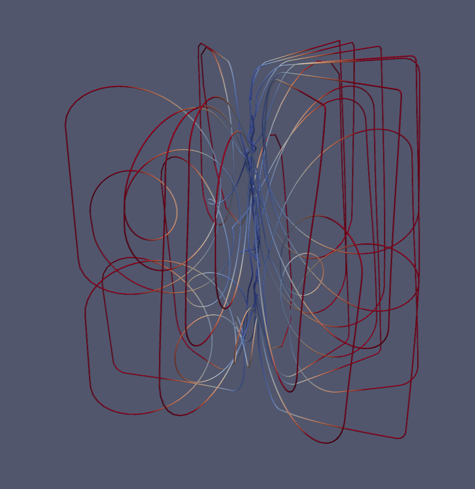

# Vortex Cores: Quantum Vortex Dynamics in Superfluid Helium

## Introduction

This codebase simulates the behavior of quantum vortex cores in superfluid helium. It provides a comprehensive framework for studying vortex dynamics under various conditions, including external fields and thermal effects. The simulation uses both CPU and GPU acceleration options for performance.



## Underlying Physics

Quantum vortices are topological defects in superfluid systems where the circulation is quantized. In superfluid helium, these vortices exhibit several unique properties:

### Fundamental Physical Properties

1. **Quantized Circulation**: Unlike classical fluids, circulation in superfluid vortices is quantized in units of κ = h/m (where h is Planck's constant and m is the mass of helium-4 atom).

2. **Zero Core**: The vortex core has effectively zero density as the superfluid order parameter vanishes at the center.

3. **Non-Local Dynamics**: Vortex motion is governed by the Biot-Savart law, creating long-range interactions between vortex segments.

### Motion Equations

Vortex filament motion is described by:

- **Local Induction Approximation (LIA)**: The self-induced velocity of a vortex filament is approximated as:
  ```
  v = β κ (log(L/a)) s' × s''
  ```
  where β is a constant, L is a characteristic length scale, a is the core radius, s' is the tangent to the vortex line, and s'' represents the curvature.

- **Full Biot-Savart Law**: For more accurate non-local interactions, the complete integral form is:
  ```
  v(r) = (κ/4π) ∫ (ds × (r - s))/|r - s|³
  ```
  where integration is performed along all vortex lines.

- **Mutual Friction**: At finite temperatures (T > 0), the interaction between the normal fluid and superfluid components introduces a drag force:
  ```
  v_drag = -α (s' × (s' × v)) - α' (s' × v)
  ```
  where α and α' are temperature-dependent friction coefficients.

## Computational Methods

Our simulation implements several advanced numerical techniques:

### Vortex Discretization

- Vortices are represented as connected discrete points in 3D space
- Adaptive point distribution ensures higher resolution in regions of high curvature
- Closed vortex rings and open vortex lines are supported

### Velocity Calculation

1. **Local Contribution**: The local induction approximation is used for self-induced motion
2. **Non-Local Contribution**: The Biot-Savart integral is computed for interactions between different vortex segments
3. **External Fields**: Various external fields can be applied:
   - Uniform flow
   - Solid body rotation
   - Oscillatory flow
   - Counterflow

### Time Integration

- Fourth-order Runge-Kutta method for accurate time evolution
- Adaptive time-stepping based on the maximum velocity
- Boundary conditions enforce containment within a cylindrical domain

### GPU Acceleration

- The computationally intensive Biot-Savart calculations are offloaded to GPU using WGPU
- WGSL shader code performs parallel computation of velocity contributions
- Dynamic GPU selection for multi-GPU systems

## Implementation Details

The codebase is structured with several key modules:

- `simulation.rs`: Core simulation logic and vortex representation, output to VTK files
- `physics.rs`: Physical constants and equations
- `compute.rs`: GPU acceleration module
- `extfields.rs`: External field implementations

## Usage

### GPU Selection and Listing

List all available GPUs:
```
cargo run -- single --list-gpus
```

Select a specific GPU by name fragment:
```
cargo run -- single --gpu --select-gpu "nvidia" --radius 0.5 --height 1.0
```

### Single Simulations

Uniform x-axis external flow, velocity 0.1 cm/s:
```
cargo run -- single --gpu --radius 0.5 --height 1.0 --temp 1.5 --steps 1000 \
  --ext-field uniform --ext-value 0.1,0,0
```

Rotation field with z-axis rotation, centered at (0, 0, 0.5), angular velocity 1.0 rad/s:
```
cargo run -- single --gpu --radius 0.5 --height 1.0 --temp 1.5 --steps 1000 \
  --ext-field rotation --ext-value 0,0,1.0 --ext-center 0,0,0.5
```

Oscillatory flow along y-axis:
```
cargo run -- single --gpu --radius 0.5 --height 1.0 --temp 1.5 --steps 1000 \
  --ext-field oscillatory --ext-value 0,0.1,0 --ext-freq 2.0 --ext-phase 0.0
```

### Parameter Studies

Run simulations across parameter ranges:
```
cargo run -- study --gpu --rmin 0.2 --rmax 1.0 --rsteps 4 --tmin 1.0 --tmax 2.1 \
  --tsteps 5 --steps 500 --ext-field rotation --ext-value 0,0,1.0 --output study_results
```

## Assumptions and Limitations

This simulation makes the following key assumptions:

1. **Core Structure**: The vortex core is treated as a 1D filament with zero thickness
2. **Incompressible Flow**: The superfluid is treated as incompressible
3. **Mutual Friction Model**: A simplified two-fluid mutual friction model based on temperature-dependent coefficients
4. **Reconnection Physics**: Vortex reconnections are handled using a distance-based criterion
5. **Boundary Conditions**: Simple reflective boundary conditions at container walls

## Requirements

- Rust compiler (2024 edition or later)
- wgpu-compatible GPU for hardware acceleration
- Optional: ParaView for visualization of VTK output files

## Future Work

- Implement more sophisticated reconnection algorithms
- Add support for turbulent normal fluid profiles
- Incorporate quantum turbulence statistics collection
- Improve performance through advanced tree-code algorithms for Biot-Savart integration

## References

1. Donnelly, R.J. (1991). Quantized Vortices in Helium II. Cambridge University Press.
2. Schwarz, K.W. (1985). Three-dimensional vortex dynamics in superfluid ⁴He: Homogeneous superfluid turbulence. Physical Review B, 38(4), 2398-2417.
3. Barenghi, C.F., Skrbek, L., & Sreenivasan, K.R. (2014). Introduction to quantum turbulence. Proceedings of the National Academy of Sciences, 111(Supplement 1), 4647-4652.
